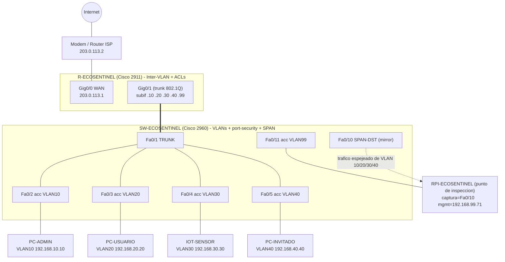

# Topología de red Cisco — EcoSentinel

Diseño de referencia de la red segmentada de EcoSentinel en equipo Cisco (IOS CLI),
alineado con el documento rector **`Arquitectura de red.pdf`** (Carpeta 2 —
Planificación Técnica y de Calidad). Listo para montarse en **Cisco Packet Tracer**
o IOS real 15.x.

## Contenido del directorio

| Archivo | Descripción |
|---------|-------------|
| `config-switch.txt` | Config IOS del switch 2960: VLANs, accesos, port-security, **SPAN** y hardening. |
| `config-router.txt` | Config IOS del router 2911: router-on-a-stick inter-VLAN + **ACLs** de segmentación. |
| `plan-de-prueba.md` | Montaje en Packet Tracer, verificación de segmentación (tabla ping) y del SPAN. |
| `README.md` | Este archivo: diagrama, mapeo doc→config y decisión de diseño del SPAN. |

---

## 1. Diagrama de la topología



**Flujo (doc, sección 2.1):** Internet → módem/router → *EcoSentinel (punto de
inspección)* → switch → VLANs. En el laboratorio, el router 2911 es el gateway
inter-VLAN y frontera a Internet, y la inspección la realiza la RPi recibiendo el
**espejo SPAN** de todo el tráfico interno.

### Plan de direccionamiento (una subred /24 por VLAN)

| VLAN | Nombre | Subred | Gateway | Dispositivo de prueba |
|------|--------|--------|---------|-----------------------|
| 10 | ADMINISTRATIVA | 192.168.10.0/24 | .1 | PC-ADMIN (.10) |
| 20 | USUARIOS | 192.168.20.0/24 | .1 | PC-USUARIO (.20) |
| 30 | IOT | 192.168.30.0/24 | .1 | IOT-SENSOR (.30) |
| 40 | INVITADOS | 192.168.40.0/24 | .1 | PC-INVITADO (.40) |
| 99 | GESTION | 192.168.99.0/24 | .1 | SW SVI (.2), RPi mgmt (.71) |
| 999 | BLACKHOLE | — (sin gateway) | — | puertos no usados (apagados) |

---

## 2. Mapeo del documento "Arquitectura de red" → configuración

| Elemento del PDF (sección 2.2 / 3.2) | Control indicado | Dónde se implementa |
|--------------------------------------|------------------|---------------------|
| **Módem / Router** | Config segura, credenciales, desactivar servicios | `config-router.txt`: `enable secret`, SSH v2, `no ip http server`, `no cdp run`, `login block-for` |
| **Switch administrable** | VLANs, control de puertos, aislamiento | `config-switch.txt`: `vlan 10-40`, `port-security`, puertos no usados a VLAN 999 apagados |
| **Raspberry Pi / EcoSentinel** | Punto de inspección, IDS, registro | Puerto **SPAN** `monitor session 1` → Fa0/10 (RPi) |
| **Red administrativa** | Acceso restringido, privilegios elevados | VLAN 10 + `ACL-ADMIN` (acceso completo) |
| **Red de usuarios** | Políticas de navegación | VLAN 20 + `ACL-USUARIOS` (sin admin/gestión) |
| **Red IoT** | Aislamiento, bloqueo a áreas críticas | VLAN 30 + `ACL-IOT` (aislado de todo lo interno, solo Internet) |
| **Red de invitados** | Solo salida a Internet, sin recursos internos | VLAN 40 + `ACL-INVITADOS` (deny a 10/20/30/99, permit Internet) |
| **Segmentación de red** (principio) | Separar admin/usuarios/IoT/invitados | 4 VLANs + subredes /24 independientes |
| **Mínimo privilegio** (principio) | Solo lo necesario | ACLs deny-first, puertos no usados apagados, `port-security max 1` |
| **Monitoreo continuo** (principio) | Registro de conexiones y anomalías | SPAN hacia RPi (IDS + modelos IA, doc 3.1) |
| **Trazabilidad** (principio) | Todo evento documentado | `banner motd`, `login block-for`, `service password-encryption` |
| **"Separar IoT e invitados de la red administrativa"** (regla 3.2) | — | `ACL-IOT` y `ACL-INVITADOS` niegan VLAN 10 |
| **"Bloquear por defecto conexiones no solicitadas"** (regla 3.2) | — | `deny` explícitos + `deny ip any any` implícito de cada ACL |

---

## 3. Decisión de diseño: ¿por qué un puerto SPAN?

El documento coloca a EcoSentinel como **"punto central de inspección"** entre el
módem y la red. Sin embargo, la RaspBerry Pi real es un **cliente WiFi en modo
*managed*** y, según `README_ECOSENTINEL.md` §7:

> *"La RPi no ve el tráfico entre otros dos dispositivos de la red… solo ve tráfico
> hacia/desde sí misma y broadcast."*

En una topología con switch, un host normal **no** ve el tráfico conmutado entre
otros puertos (el switch solo lo envía al puerto destino). Para que EcoSentinel
cumpla su rol de inspección y **detecte escaneos entre terceros**, la solución
correcta y estándar es un **puerto SPAN / mirror**:

```
monitor session 1 source vlan 10,20,30,40 both
monitor session 1 destination interface FastEthernet0/10   ! puerto de la RPi
```

El switch **replica** todo el tráfico de las 4 VLANs hacia el puerto de la RPi, que
lo escucha en modo promiscuo. Así el diseño Cisco entrega a EcoSentinel exactamente
lo que su modo managed le niega, sin poner a la RPi en línea (sigue sin cortar
tráfico por sí sola; el bloqueo se confirma en el router — coherente con §7).

---

## 4. Tabla de verificación de segmentación (resumen)

| Origen → Destino | Resultado | Origen → Destino | Resultado |
|------------------|-----------|------------------|-----------|
| Admin → Usuarios | ✅ PERMIT | IoT → Admin | ⛔ DENY |
| Admin → IoT | ✅ PERMIT | IoT → Usuarios | ⛔ DENY |
| Admin → Invitados | ✅ PERMIT | IoT → Invitados | ⛔ DENY |
| Admin → Internet | ✅ PERMIT | IoT → Internet | ✅ PERMIT |
| Usuarios → Admin | ⛔ DENY | Invitados → Admin | ⛔ DENY |
| Usuarios → Gestión | ⛔ DENY | Invitados → Usuarios | ⛔ DENY |
| Usuarios → IoT | ✅ PERMIT | Invitados → IoT | ⛔ DENY |
| Usuarios → Internet | ✅ PERMIT | Invitados → Internet | ✅ PERMIT |

Procedimiento y comandos de comprobación (`ping`, `show access-lists`,
`show monitor session 1`) en **`plan-de-prueba.md`**.

---

## 5. Alcance / presupuesto y relación con la demo real

El **Plan de Adquisiciones** fija un presupuesto de **$3,000 MXN** (RPi 3A+ +
microSD, proyecto de bajo costo). Un switch administrable Cisco y un router 2911
**exceden ese presupuesto**, por lo que esta topología Cisco es el **diseño de
referencia / entorno de laboratorio (Packet Tracer)**, no el despliegue casero.

**Demo real (bajo presupuesto):** en el laboratorio físico EcoSentinel corre en la
RPi 3A+ como cliente WiFi (modo managed, `192.168.1.71`) detrás de un repetidor/AP
WiFi doméstico; ve su propio tráfico + broadcast y los ataques de prueba se dirigen
**a la RPi**. La topología Cisco de este directorio demuestra cómo se vería el mismo
diseño con segmentación real por VLAN y un SPAN entregando todo el tráfico a
EcoSentinel — es la evolución "empresarial" del mismo modelo de defensa en
profundidad, minimo privilegio, segmentación, monitoreo y trazabilidad del documento.
